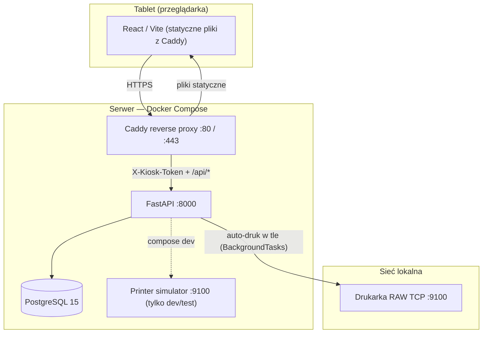

# KioskAPI — Kompleksowa Dokumentacja Systemu

KioskAPI to zlokalizowany system rejestracji uczestników, automatycznego generowania cyfrowych oświadczeń (PDF) z odręcznymi podpisami oraz drukowania na drukarce LAN. System jest przeznaczony do instalacji on-premise (serwer w sieci lokalnej + tablety w trybie kiosku), np. na torach kartingowych i obiektach sportowych.

---

## Spis treści

1. [Architektura systemu](#1-architektura-systemu)
2. [Struktura projektu](#2-struktura-projektu)
3. [Przepływy informacji](#3-przepływy-informacji)
4. [Uruchomienie produkcyjne](#4-uruchomienie-produkcyjne)
5. [Konfiguracja urządzeń zewnętrznych](#5-konfiguracja-urządzeń-zewnętrznych)
6. [Rozwój i testowanie](#6-rozwój-i-testowanie)
7. [Zasady bezpieczeństwa i RODO](#7-zasady-bezpieczeństwa-i-rodo)
8. [Zmiany formularza, PDF i regulaminu](#8-zmiany-formularza-pdf-i-regulaminu)

---

## 1. Architektura systemu

System działa lokalnie w sieci LAN. Orkiestracja: **Docker Compose**.



### Komponenty

| Usługa | Rola |
|--------|------|
| **reverse-proxy (Caddy)** | HTTPS (`tls internal`), serwowanie zbudowanego frontendu, proxy `/api/*` do API, **wstrzykiwanie nagłówka `X-Kiosk-Token`** (token nie trafia do bundla JS). |
| **api (FastAPI)** | REST API, JWT w HttpOnly cookie, generowanie PDF (PyMuPDF), zapis podpisów, kolejka druku w **FastAPI `BackgroundTasks`** (in-process, nie osobny worker). |
| **db (PostgreSQL)** | Użytkownicy, formularze, zgłoszenia, zadania druku (`print_jobs`). |
| **printer-simulator** | Opcjonalny symulator portu 9100 — zapisuje strumień RAW do `storage/printed_files`. W produkcji zwykle **wyłączony**; API kieruje się na fizyczną drukarkę. |

> **Uwaga:** W `app/core/config.py` są pola `redis_url` / `celery_*` — to **rezerwa na przyszłość**, obecnie **nie są używane** w runtime ani w `docker-compose.yml`.

---

## 2. Struktura projektu

```text
KioskAPI/
├── alembic/                 # Migracje bazy danych
├── app/
│   ├── api/v1/              # Routery HTTP (kiosk, auth, me, admin)
│   ├── core/                # Config, security, middleware, błędy
│   ├── models/              # SQLAlchemy
│   ├── schemas/             # Pydantic
│   └── services/            # PDF, drukarka, zgłoszenia, podpisy
├── documentation/           # Kontrakty API, backlog epików
├── frontend/                # React + Vite (JS/JSX)
├── infrastructure/
│   ├── caddy/               # Caddyfile + Dockerfile (build FE + proxy)
│   └── printer_simulator/   # Symulator drukarki TCP 9100
├── scripts/                 # docker-entrypoint.sh, seed formularza
├── storage/                 # Podpisy, wygenerowane pliki (wolumen)
├── templates/forms/         # Szablony PDF formularzy
├── tests/                   # pytest
├── Dockerfile               # Obraz API
├── docker-compose.yml
└── .env.example
```

---

## 3. Przepływy informacji

Wszystkie endpointy API są pod prefiksem **`/api/v1`**. Nagłówek **`X-Kiosk-Token`** jest wymagany na endpointach kiosku (w produkcji dokleja go Caddy).

### A. Gość (Guest)

1. Ekran startowy → formularz gościa.
2. Wybór roli i pojazdu, dane osobowe, zgody, podpis na `SignaturePad` (PNG → base64).
3. `POST /api/v1/kiosk/submissions` (bez JWT) — tryb `guest`.
4. Backend: walidacja, zapis podpisu, numer startowy, commit zgłoszenia.
5. Jeśli **`PRINT_ENABLED=true`** — auto-druk w tle (`BackgroundTasks`); jeśli `false` — status `submitted`, druk tylko z panelu admina.
6. Ekran wyniku: podgląd PDF (`GET /api/v1/kiosk/submissions/{id}/pdf`), status druku (kolejka / OK / błąd).

### B. Konto (Account)

1. Rejestracja `POST /api/v1/auth/register` lub logowanie `POST /api/v1/auth/login` (JWT w cookie).
2. Prefill: `GET /api/v1/me/form-prefill?role=...&vehicle_type=...`.
3. Weryfikacja danych, podpis, `POST /api/v1/kiosk/submissions` (z cookie JWT) — tryb `account`.
4. Profil użytkownika aktualizowany po zapisie; auto-druk jak wyżej, zależnie od `PRINT_ENABLED`.

### C. Opiekun prawny (Guardian)

1. Rola `legal_guardian`, lista podopiecznych `GET /api/v1/account/related-persons`.
2. Osobne zgłoszenie per podopieczny (`POST .../related-persons/{id}/submissions`) — każdy dostaje własny numer startowy i ewentualny wydruk.

### Druk — kto i kiedy

| Mechanizm | `PRINT_ENABLED=true` | `PRINT_ENABLED=false` |
|-----------|----------------------|------------------------|
| Auto-druk po submitcie użytkownika | Tak (w tle) | Nie |
| Druk z panelu admina | Tak (`force=true`) | Tak |
| Status „Drukarka” w panelu admina | TCP do `PRINTER_HOST:PORT` (niezależny od flagi) | j.w. |

Użytkownik **nie klika „Drukuj”** — przy włączonej fladze druk jest automatyczny po wysłaniu formularza.

---

## 4. Uruchomienie produkcyjne

### Wymagania

- Docker Engine lub Docker Desktop na serwerze LAN.
- Porty **80** i **443** dostępne dla tabletów (firewall).
- Statyczny IP serwera i (zalecane) drukarki w sieci lokalnej.

### Krok 1 — plik `.env`

```bash
cp .env.example .env
```

Uzupełnij **obowiązkowo** (aplikacja przy `APP_ENV=production` odrzuci start ze słabymi sekretami):

| Zmienna | Produkcja |
|---------|-----------|
| `APP_ENV` | `production` |
| `DEBUG` | `false` |
| `KIOSK_TOKEN` | Losowy, min. 16 znaków, **inny niż placeholder** |
| `JWT_SECRET_KEY` | Losowy, min. 32 znaki, **inny niż placeholder** |
| `POSTGRES_PASSWORD` | Silne hasło (nie `kiosk`) |
| `AUTH_COOKIE_SECURE` | `true` (wymuszane też przez walidator produkcyjny) |
| `TRUSTED_HOSTS` | Konkretne hosty/IP serwera, **nie** `["*"]` |
| `START_NUMBER_TIMEZONE` | np. `Europe/Warsaw` |
| `PRINT_ENABLED` | `true` = użytkownik dostaje auto-druk; `false` = druk tylko admin |
| `PRINTER_HOST` / `PRINTER_PORT` | IP fizycznej drukarki, port **9100** (RAW) |
| `KIOSK_IDLE_LOGOUT_SECONDS` | Czas bezczynności (wbudowywany w obraz Caddy przy buildzie) |

Generowanie sekretów (przykład):

```bash
python -c "import secrets; print(secrets.token_urlsafe(32))"
```

### Krok 2 — dostosuj `docker-compose.yml` pod produkcję

Domyślny plik jest nastawiony na **dev** (symulator drukarki, `DEBUG=true`, wystawiona baza). Przed produkcją:

1. **Drukarka** — w sekcji `api` ustaw realny host zamiast `printer-simulator`:
   ```yaml
   PRINTER_HOST: ${PRINTER_HOST:-192.168.1.100}
   PRINTER_PORT: ${PRINTER_PORT:-9100}
   ```
2. **Usuń lub zakomentuj usługę `printer-simulator`** i jej port `9100:9100` na hoście — nie powinien być publiczny w prod.
3. **PostgreSQL** — rozważ **usunięcie** mapowania `"5432:5432"` (baza tylko w sieci Docker), albo bind tylko do `127.0.0.1`.
4. **Sekrety** — nie polegaj na domyślnych wartościach w compose (`change-me-...`); wszystko z `.env`.
5. **Swagger** — FastAPI wyłącza `/docs` gdy `APP_ENV=production`, ale Caddy nadal może proxy’ować ścieżki dokumentacji; w razie potrzeby zablokuj `@api_docs` w `infrastructure/caddy/Caddyfile`.

### Krok 3 — szablony i wolumeny

- Plik **`templates/forms/guest-registration-v1.pdf`** musi istnieć (seed formularza wskazuje tę ścieżkę). Brak szablonu → błąd **500** przy generowaniu PDF (zgłoszenie w bazie już jest).
- Wolumeny `./storage` i `./templates` muszą być trwałe i objęte backupem (podpisy, ewentualne pliki druku testowych).

### Krok 4 — build i start

```bash
docker compose up -d --build
```

Przy starcie kontenera `api` (`scripts/docker-entrypoint.sh`):

1. `alembic upgrade head`
2. `scripts/seed_active_form.py` — aktywny formularz w bazie
3. `uvicorn main:app` (bez `--reload`)

### Krok 5 — weryfikacja

| Test | Oczekiwany wynik |
|------|------------------|
| `https://<IP-serwera>/` | Ekran startowy kiosku |
| `https://<IP-serwera>/api/v1/health` | JSON ze `status: ok`, `database: ok` |
| Panel admina po zalogowaniu | **Drukarka: OK/BŁĄD** = połączenie TCP; **Druk użytkownika** = wartość `PRINT_ENABLED` |
| Nowe zgłoszenie przy `PRINT_ENABLED=false` | Status `submitted`, bez auto-druku |
| Druk z admina | Działa niezależnie od `PRINT_ENABLED` |

### Krok 6 — pierwsze konto administratora

Rejestracja przez kiosk tworzy zwykłego użytkownika (`is_superuser=false`). Nadanie uprawnień admina — ręcznie w bazie:

```bash
docker compose exec db psql -U kiosk -d kiosk -c \
  "UPDATE users SET is_superuser = true WHERE email = 'admin@example.com';"
```

### Checklist bezpieczeństwa (produkcja)

- [ ] Zmienione `KIOSK_TOKEN` i `JWT_SECRET_KEY` (nie placeholdery z compose).
- [ ] `APP_ENV=production`, `DEBUG=false`.
- [ ] Silne hasło PostgreSQL; port 5432 nie wystawiony na LAN bez potrzeby.
- [ ] `TRUSTED_HOSTS` ograniczone do realnych hostów.
- [ ] `AUTH_COOKIE_SECURE=true` (HTTPS przez Caddy).
- [ ] Certyfikat Caddy (`tls internal`) zainstalowany na tabletach lub świadoma decyzja o HTTP (niezalecane).
- [ ] Symulator drukarki i port 9100 na hoście wyłączone w prod.
- [ ] Szablon PDF obecny w `templates/forms/`.
- [ ] Backup wolumenu `postgres_data` i `storage`.

### Typowe problemy

| Objaw | Przyczyna | Działanie |
|-------|-----------|-----------|
| **401** na API z tabletu | Brak / zły `X-Kiosk-Token` | Token w `.env` musi być zgodny z tym, co Caddy wstrzykuje (`KIOSK_TOKEN` w compose dla `reverse-proxy`). |
| **Drukarka: BŁĄD** w adminie | Brak TCP do `PRINTER_HOST:9100` | Sprawdź IP, firewall, kabel/sieć; to **nie** jest skutek `PRINT_ENABLED=false`. |
| Status **Błąd druku** na zgłoszeniu | Drukarka niedostępna przy `PRINT_ENABLED=true` | Napraw połączenie lub ustaw `PRINT_ENABLED=false` i drukuj z admina. |
| **500** przy PDF | Brak pliku szablonu | Dodaj `guest-registration-v1.pdf` lub popraw `pdf_template_path` w seedzie. |
| Aplikacja nie startuje | Słabe sekrety przy `APP_ENV=production` | Użyj losowych tokenów — walidator w `Settings.validate_production_safety`. |

---

## 5. Konfiguracja urządzeń zewnętrznych

### Drukarka LAN (RAW TCP, port 9100)

1. Statyczny IP drukarki (np. `192.168.1.100`).
2. W `.env`: `PRINTER_HOST`, `PRINTER_PORT=9100`.
3. `PRINT_ENABLED` — patrz sekcja [Druk — kto i kiedy](#druk--kto-i-kiedy).

Healthcheck w panelu admina to **test połączenia TCP**, nie diagnostyka „brak papieru” (wymagałoby protokołu producenta).

### Tablet (kiosk)

- Ta sama sieć Wi‑Fi/LAN co serwer.
- Adres: `https://<IP-serwera>` (Caddy).
- Certyfikat wewnętrzny Caddy: zainstaluj root CA z wolumenu `caddy_data` (`/data/caddy/pki/authorities/local/root.crt`) na tablecie, albo (niezalecane) HTTP + `AUTH_COOKIE_SECURE=false`.

---

## 6. Rozwój i testowanie

### Zalecany sposób — Docker Compose

```bash
cp .env.example .env
docker compose up -d --build
```

- Aplikacja: `https://localhost` (Caddy) lub API wewnętrznie na porcie 8000 (tylko w sieci compose).
- Symulator drukarki: port **9100**, pliki w `storage/printed_files/`.
- **Redis nie jest wymagany.**

Logi API: `docker compose logs api -f`

### Backend lokalnie (bez Dockera)

1. `uv sync`
2. Działająca **PostgreSQL** (Redis **nie** jest potrzebny).
3. `.env` z `DATABASE_URL=postgresql+psycopg_async://...@localhost:5432/kiosk`
4. `uv run alembic upgrade head`
5. `uv run python scripts/seed_active_form.py`
6. `uv run uvicorn main:app --reload --port 8000`

Frontend w dev często przez osobny kontener Vite — patrz `.cursor/rules/docker-dev-environment.mdc` w repozytorium.

### Testy

```bash
uv run pytest
```

Testy obejmują m.in. auth, zgłoszenia, podpisy, PDF, drukarkę (mock / lokalny TCP server).

### Nowa migracja

```bash
uv run alembic revision --autogenerate -m "opis zmiany"
uv run alembic upgrade head
```

---

## 7. Zasady bezpieczeństwa i RODO

- **Idle logout:** po zalogowaniu sesja wygasa po bezczynności (domyślnie 30 s dla użytkownika, 5 min dla admina w UI; parametr `KIOSK_IDLE_LOGOUT_SECONDS` jest przekazywany przy buildzie obrazu Caddy).
- **Token kiosku:** tylko po stronie reverse proxy — nie umieszczaj `KIOSK_TOKEN` w frontendzie.
- **JWT:** HttpOnly cookie, `SameSite=strict`, Argon2id dla haseł.
- **Lockout:** 5 nieudanych logowań → blokada 15 min; rate limit na endpoint logowania.
- **RODO:** wymagane oświadczenia przed wysłaniem formularza; opcjonalna zgoda na publikację wizerunku.
- **Wersjonowanie formularza:** każde zgłoszenie wiązane z `form_version` w bazie.

Dalsze kontrakty API i backlog: katalog `documentation/` (m.in. `API_Contract_MVP.md`, `account-mode-tasks.md`).

---

## 8. Zmiany formularza, PDF i regulaminu

Formularz rejestracyjny składa się z **kilku warstw**. Przy każdej zmianie trzeba wiedzieć, której warstwy dotyczy — inaczej kiosk, PDF lub druk będą niespójne.

### Warstwy — co za co odpowiada

| Warstwa | Gdzie w repo | Co kontroluje |
|---------|--------------|---------------|
| **Treść regulaminu / oświadczeń (UI)** | `frontend/src/content/participantDeclarations.js` | Tekst przewijany na tablecie przed wysłaniem (`DeclarationsPanel`). |
| **Pola formularza na tablecie** | `scripts/seed_active_form.py` → `schema_json` (+ częściowo `frontend/src/lib/registrationFormShared.js`) | Jakie pola są wymagane, etykiety, walidacja PESEL itd. Kiosk pobiera schemat z API (`GET /api/v1/kiosk/forms/active`). |
| **Szablon PDF (layout, checkboxy, podpis)** | `templates/forms/*.pdf` + `schema_json.pdf_mapping` w seedzie | Wygląd wydruku, pozycja podpisu, nazwy pól AcroForm w PDF. |
| **Mapowanie danych → PDF** | `app/services/pdf_mapping.py` + sekcja `pdf_mapping` w `schema_json` | Które dane z formularza trafiają do którego pola/checkboxa w PDF. |
| **Wersja formularza** | pole `version` w tabeli `forms` (seed) | Każde zgłoszenie zapisuje `form_version` z momentu wysłania — **stare PDF-y się nie zmieniają**. |

```text
Tablet (React)          Backend (seed / DB)           Wydruk (PDF)
─────────────────       ───────────────────           ──────────────
participantDeclarations schema_json.required    pdf_template_path
registrationSchemas.js  schema_json.properties  pdf_mapping.text_fields
SignaturePad (canvas)   schema_json.pdf_mapping pdf_mapping.checkboxes
                        version                   pdf_mapping.signature
```

### Zasada wersjonowania

- **Podnieś `version`** w `scripts/seed_active_form.py` (np. `1.0` → `1.1`) przy każdej zmianie prawnej lub layoutu PDF — ułatwia audyt i rozróżnienie zgłoszeń.
- Przy większej przebudowie PDF warto nowy plik, np. `guest-registration-v2.pdf`, i zaktualizować `pdf_template_path`.
- **Nie edytuj** historycznych zgłoszeń — mają zamrożone `form_id` / `form_version`. Nowy układ obowiązuje tylko od kolejnych rejestracji.

### Jak postępować — według typu zmiany

#### A. Tylko treść regulaminu (np. nowy punkt oświadczenia)

**Dotyczy:** dodanie/zmiana akapitu w sekcji „Oświadczenia”, bez zmiany pól ani PDF.

| Krok | Działanie |
|------|-----------|
| 1 | Edytuj `frontend/src/content/participantDeclarations.js` (`PARTICIPANT_DECLARATIONS`, ewentualnie `IMAGE_PUBLICATION_CONSENT_TEXT`). |
| 2 | (Zalecane) Podnieś `version` w seedzie — np. `1.0` → `1.1`. |
| 3 | Zbuduj ponownie reverse proxy (frontend jest w obrazie Caddy): `docker compose up -d --build reverse-proxy` |
| 4 | Zaktualizuj rekord formularza w bazie: restart API (`docker compose restart api`) uruchomi seed, **albo** ręcznie `docker compose exec api uv run python scripts/seed_active_form.py` |

> Jeśli **ten sam tekst** musi być na **fizycznym PDF**, trzeba też wyedytować szablon PDF (punkt B) — samo UI go nie zmieni.

#### B. Zmiana layoutu PDF (inna pozycja podpisu, przesunięte pola, nowe checkboxy na wydruku)

**Dotyczy:** nowy/edytowany plik PDF od grafika/prawnika.

| Krok | Działanie |
|------|-----------|
| 1 | Przygotuj nowy szablon z polami formularza AcroForm (Adobe Acrobat, LibreOffice PDF, itp.). Zanotuj **wewnętrzne nazwy pól** (np. `text_10hcx`, `checkbox_7agj`) — w PyMuPDF: `page.widgets()` / podgląd w edytorze PDF. |
| 2 | Zapisz plik w `templates/forms/` (np. `guest-registration-v2.pdf`). |
| 3 | W `scripts/seed_active_form.py` zaktualizuj: |
| | • `pdf_template_path` — ścieżka do nowego pliku |
| | • `schema_json.pdf_mapping.signature` — `page` (0 = pierwsza strona) i `rect` `[x0, y0, x1, y1]` obszaru podpisu |
| | • `pdf_mapping.text_fields` — mapowanie `{full_name}`, `{phone}`, … na nazwy pól PDF |
| | • `pdf_mapping.checkboxes` — mapowanie ról/pojazdów na checkboxy |
| | • `pdf_mapping.consents` — np. `image_publication` → nazwa checkboxa |
| 4 | Podnieś `version`. |
| 5 | Wdróż: skopiuj `templates/` na serwer, `docker compose restart api` (seed + migracja ścieżki), test PDF (poniżej). |

Wspierane placeholdery tekstowe (m.in.): `full_name`, `identity_document`, `start_number`, `vehicle_brand_model`, `minor_full_name`, `signature_place` — pełna lista w `app/services/pdf_mapping.py` (`context`).

Brakujące pole w payloadzie **nie psuje** generowania — w PDF wstawia się pusty string (`SafePayload`).

#### C. Więcej / mniej checkboxów lub pól na tablecie (nie tylko na PDF)

**Dotyczy:** nowe pole „Nr licencji”, dodatkowa zgoda, usunięcie pola.

| Obszar | Pliki |
|--------|-------|
| Schemat API / walidacja BE | `scripts/seed_active_form.py` — `properties`, `required` |
| Lista pól osobowych | `frontend/src/lib/registrationFormShared.js` — `PERSONAL_DATA_FIELDS`, `VEHICLE_DATA_FIELDS`, `GUARDIAN_FIELDS` |
| Walidacja FE | `frontend/src/lib/registrationSchemas.js` |
| Nowa zgoda (checkbox) | `participantDeclarations.js`, `GuestRegistrationForm.jsx`, `registrationFormShared.js` (`consents_json`), `pdf_mapping.consents` w seedzie |
| Checkbox na PDF | `pdf_mapping.checkboxes` lub `consents` + nowy widget w szablonie PDF |

Po zmianach: **rebuild frontendu** (jeśli UI) + **seed** (jeśli schemat) + test E2E (wypełnij formularz → podgląd PDF).

#### D. Zmiana ról, typów pojazdów lub typów opiekuna

Wartości enumów są na backendzie (`ParticipantRole`, `VehicleType`). Na frontendzie: `registrationFormShared.js` (`PARTICIPANT_ROLES`, `VEHICLE_TYPES`, `GUARDIAN_RELATIONS`).

W `pdf_mapping.checkboxes` klucze muszą odpowiadać wartościom enum (np. `"driver"` → nazwa checkboxa w PDF). Zmiana wymaga spójności **FE + seed + PDF**.

### Wdrożenie zmian na produkcji (checklist)

1. Zmiany w kodzie / szablonach na serwerze (git pull lub kopiowanie plików).
2. Nowy PDF → upewnij się, że wolumen `./templates` na hoście zawiera plik.
3. **Backend / schemat:** `docker compose restart api` (entrypoint odpala seed — nadpisuje aktywny formularz o kodzie `guest-registration`).
4. **Frontend:** `docker compose up -d --build reverse-proxy` (statyczne pliki + ewentualny `KIOSK_IDLE_LOGOUT_SECONDS`).
5. Na tablecie: twarde odświeżenie cache (Ctrl+F5) lub tryb prywatny.
6. Test: jedno zgłoszenie testowe → podgląd PDF → opcjonalnie druk próbny z panelu admina.

### Weryfikacja po zmianie

```bash
# Testy mapowania PDF (lokalnie)
uv run pytest tests/services/test_pdf_mapping.py tests/services/test_pdf.py -q

# Ręczny seed (gdy API już działa)
docker compose exec api uv run python scripts/seed_active_form.py

# Sprawdzenie aktywnej wersji — w UI kiosku w nagłówku formularza:
# „Wersja formularza: X.Y” (pole form.version z API)
```

Na produkcji: po deployu wyślij **zgłoszenie testowe**, pobierz PDF (`GET /api/v1/kiosk/submissions/{id}/pdf` lub podgląd na ekranie wyniku) i sprawdź:

- czy wszystkie pola tekstowe są na właściwych miejscach,
- czy zaznaczone są właściwe checkboxy (rola, pojazd, zgody),
- czy podpis jest w nowym prostokącie,
- czy numer startowy i data się zgadzają.

### Częste błędy

| Problem | Przyczyna |
|---------|-----------|
| PDF 500 / „template not found” | Brak pliku pod `pdf_template_path` w `templates/forms/` na serwerze. |
| Puste pole na PDF mimo wypełnienia na tablecie | Zła nazwa w `pdf_mapping.text_fields` (literówka w nazwie widgetu PDF). |
| Checkbox nie zaznaczony | Brak wpisu w `pdf_mapping.checkboxes` / `consents` lub inna wartość enum niż w mapowaniu. |
| Podpis poza polem | Złe współrzędne `pdf_mapping.signature.rect` (układ PDF: origin często lewy górny róg, jednostki punktów). |
| Nowe pole nie widać na tablecie | Brak w `schema_json.properties` / `required` lub brak w stałej `PERSONAL_DATA_FIELDS` (pola poza listą nie renderują się automatycznie). |
| Stary regulamin na tablecie | Nie przebudowano obrazu `reverse-proxy` — frontend jest wbudowany w Caddy, nie montowany z hosta. |
| Zgłoszenia sprzed zmiany „inne” niż nowe | Oczekiwane — `form_version` jest zamrożony per zgłoszenie. |

### Kiedy tworzyć nowy rekord formularza zamiast nadpisywać seed

Domyślny seed **aktualizuje** istniejący formularz o kodzie `guest-registration`. To wystarczy w większości przypadków.

Rozważ **nowy `code`** (np. `guest-registration-2026`) i dezaktywację starego tylko gdy chcesz świadomie utrzymać dwa równoległe szablony — wymaga to wtedy zmiany `ACTIVE_FORM_CODE` w seedzie lub ręcznej edycji w bazie. Na co dzień wystarczy podbicie `version` i ewentualnie nowa nazwa pliku PDF.

